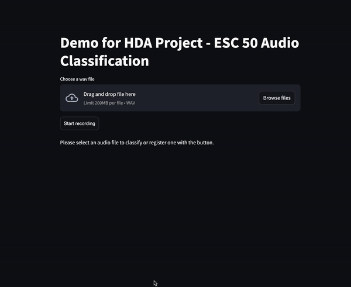
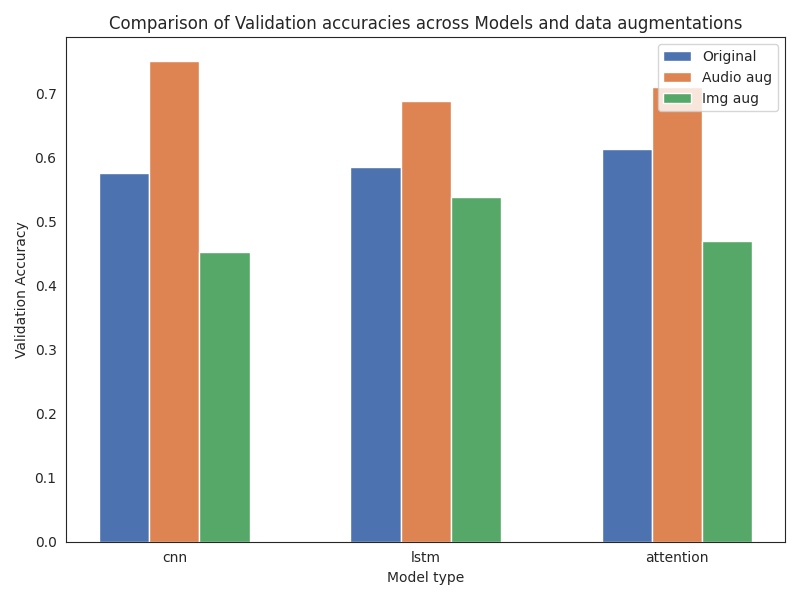

# Exploring CNN, LSTM, and Attention Mechanism on ESC-50 Dataset

This folder contains the final project for the course "Human Data Analytics". 
It explores the performance of three different deep learning models: CNN, CNN-LSTM and CNN-LSTM-Attention for environmental sound classification using the ESC-50 dataset.
The models were tested across multiple data augmentation scenarios, and the performance was evaluated using a cross-
validation approach to ensure robustness. Results show that audio augmentation consistently improves
model performance, leading to significant accuracy gains across all models.

## Contents

The repo includes the following files and directories:

```

└── 📁docs
    └── categories.json
    └── demo.ipynb
    └── esc50.csv
    └── frog.wav #example wav for demo
    └── preprocessing_dataset.ipynb
    └── results.csv # summary of the best validation accuracies results. 
    └── results.ipynb # Generation of figures for the paper
└── 📁imgs # pictures generated with the results notebook and the architecture sketches
    └── comparison.png
    └── ...
└── 📁logs # all the training logs
    └── cnn_lstm_attention_training_16k_audio.log
    └── ...
└── 📁models # The best model for each fold was saved, now only the best model was retained for file size reasons.
        └── cnn_lstm_attention_model_audio_4.kerasù
        └── ...
└── 📁src
    └── data_utils.py  # functions to handle the dataset, the preprocessing and the loading of the data loader.
    └── demo.py
    └── models.py
└── demo.gif
└── main.py
└── paper.pdf # Summary of the methods and results.
└── README.md
└── requirements.txt
└── test_architectures.py # used to check the training progress for the models

```


## Usage

To use the files and resources in this folder, follow these steps:

1. Clone or download this folder to your local machine.
2. Open the project in your preferred development environment.
3. Create a conda env and install the required packages via `pip install -r requirements.txt` 
3. Explore the different directories to access the relevant files and resources.

## Training

0. Download the ESC-50 dataset 
1. Generate the dataset augmentations with the `preprocessing_dataset.ipynb` notebook.
2. Launch `test_architectures.py` to launch the training for all the three models and three dataset types.
3. Generate results figures with the notebook `results.ipynb`.

## Demo with Streamlit

0. run `streamlit run main.py` and open in browser the app
1. load a wav file or register with your laptop's microphone and see if the model can identify the right class.




## Results

<center>
    <figure>
        
        <figcaption> Comparison between the three different models.  </figcaption>
    </figure>
</center>

